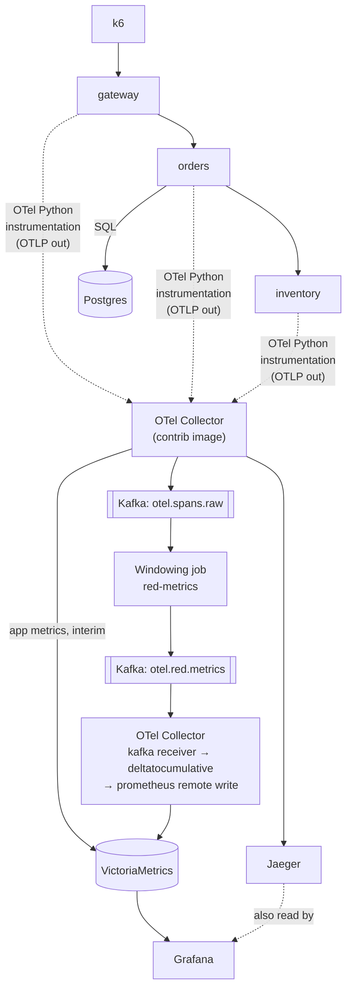

# Observability Pipeline: v1.0 Design

Status: draft for build. Date: 2026-10-03. Scope: v1.0 only.

## 1. Purpose and constraints

This is a personal learning and portfolio project: a small Datadog-style pipeline that turns distributed traces into RED metrics (rate, errors, duration) with a hand-written Kafka windowing job in Python. The reader it has to convince is an outside engineer who spends a couple of minutes on the README, so the repository must run with one command and show measured results instead of claims.

Learning priorities, in order: distributed streaming semantics, DDD modeling, Python depth (async services, instrumentation, the Kafka client), portfolio polish. v1.0 serves the first and third. DDD enters in v2.0.

The budget is 3 to 5 hours a week, roughly 40 to 60 hours over 12 weeks. The date is fixed and scope flexes. The one pre-committed cut is the Kafka-routed metrics topology, which moves to v1.1. No secondary cut order has been decided; if one is needed, decide it before week 8, not during it.

## 2. Scope

In scope: three instrumented FastAPI services, an OpenTelemetry Collector, a single-broker Kafka, a Python windowing job that derives RED metrics from spans, VictoriaMetrics, Jaeger, Grafana, a k6 load script, two fault experiments, a few window-logic tests, a README, and ADRs.

Out of scope: metrics routed through Kafka (v1.1), alerting and SLOs (v2.0), the service catalog (v2.1), logs, multi-tenancy, Kubernetes or cloud deployment, Testcontainers and CI test automation, multi-broker and replication experiments, and topic-replay experiments.

## 3. Architecture

The Collector appears twice for readability. It is one instance with several pipelines.

There are three flows. The trace path takes spans from the services to the Collector, which fans them out to Jaeger for viewing and to Kafka for processing. The derivation path takes spans from Kafka through the windowing job, which writes windowed delta metrics to an output topic that the same Collector reads and forwards to VictoriaMetrics. The interim metrics path sends application metrics from the services through the Collector straight to VictoriaMetrics; in v1.1 this is rerouted through Kafka and the reroute is documented as a migration.

## 4. Design decisions

**4.1 Runtime.** Docker Compose on one machine, started by a single command. No Kubernetes, no cloud. Deployment is a second project's worth of problems, and one-command startup is what lets a reader try the repo. The home lab or AWS can host an optional v1.1 deployment.

**4.2 Workload.** Three FastAPI services on Python 3.13, run with uvicorn: gateway, orders, inventory, called over HTTP with httpx. Orders uses SQLAlchemy over Postgres (psycopg 3) and has a list endpoint that triggers the N+1 query problem on purpose through lazy-loaded relationships, so the extra queries appear as SQL spans in Jaeger. The workload is not the learning target, so the domain stays minimal.

**4.3 Instrumentation.** All three services run under `opentelemetry-instrument`, with the FastAPI, httpx, and SQLAlchemy instrumentors, plus manual spans in one service (orders, by default). Manual spans show the API and how context propagates across threads: `contextvars` carry the active span into async tasks automatically but not into a `ThreadPoolExecutor`, which is the case worth demonstrating. Versions are pinned in `uv.lock`, because the auto-instrumentation packages are separately versioned and a mismatched set can silently skip instrumenting a library. The README must include a step that confirms spans actually arrive.

**4.4 Transport and keying.** The Collector's Kafka exporter writes spans to one topic, keyed by trace ID so a whole trace stays on one partition. That layout would also support tail sampling later. The job derives its own key from service, operation, span kind, and status, but because one process reads every partition, it aggregates in memory and no repartition topic is needed. This gives up the shuffle that Kafka Streams would show, and the horizontal scaling that goes with it. Scaling out is a v1.0 non-goal.

**4.5 Engine and guarantee.** A plain `confluent-kafka` consumer and transactional producer, with windowing written by hand. Kafka Streams is JVM-only. Quix Streams would give windows and grace out of the box, but it hides the exact mechanics (stream time, emit-once, state recovery) that are the learning goal. Flink's cluster overhead would eat scarce hours. The cost of the hand-written route is that the job owns state recovery, which is the hardest part (see 4.6). Exactly-once covers consume-process-produce through Kafka transactions, with offsets committed in the producing transaction.

**4.6 Event time.** Windows use span end time, not the Kafka record timestamp, which is the Collector's send time. The Collector batches several spans into one Kafka message, so the job splits each message into single spans first and assigns each to a window by its end time. The window logic is a pure class that takes spans and stream time and returns closed windows, so it is testable without a broker. State recovery is the least certain piece: open windows live in memory, so the job commits only the offset of the earliest span still in an open window and records the last emitted window in the same transaction. On restart it replays from there and skips windows already emitted. This must be prototyped early.

**4.7 Windows and emission.** Tumbling windows of 15 seconds with 30 seconds of grace, emitted once when stream time passes window end plus grace. Emit-once is chosen because the sink is an append-only time series, and several values for one window timestamp are rejected or kept ambiguously by time-series stores. The cost is that results appear at least 45 seconds after the window's start. Spans arriving after grace are dropped and counted by the job.

One consequence must be designed around. Stream time advances only as records arrive. With emit-once, the last windows of a burst stay buffered until later spans push stream time past their end plus grace. Two measures follow. One process reads all partitions, so any span advances stream time. And every experiment sends continuous low-rate heartbeat requests to a separate operation that the oracle excludes, running at least 90 seconds beyond the real load.

**4.8 RED semantics.** All spans are counted, split by span kind. Dashboards and later alerts must filter on `span_kind=SERVER`, or request counts double (one client span plus one server span per call). Error means span status ERROR. Duration is an explicit-bucket histogram, so `histogram_quantile` works in PromQL.

**4.9 Temporality and sink.** Counts and histograms are emitted as delta values per closed window, which preserves event-time correctness: a late span lands in the window it belongs to. The Collector's `deltatocumulative` processor converts them for Prometheus remote write. The job emits OTLP-encoded metrics to an output topic, read by the Collector's Kafka receiver and forwarded to VictoriaMetrics, so no custom sink code exists. The conversion state is in the Collector's memory, so a Collector restart resets counters. That is accepted and documented, not hidden.

**4.10 Storage and viewers.** VictoriaMetrics single-node for metrics, because it accepts Prometheus remote write and answers PromQL-style queries. Jaeger v2 for raw traces. Grafana reads both.

**4.11 Faults and load.** Each service has two environment variables: fail every Nth request (a lock-protected counter and a single uvicorn worker per service, so the total error count is exactly the request count divided by N, rounded down, regardless of concurrency), and a fixed added latency. Both are changed by restarting the service. k6 provides the known load using a fixed-iterations executor, so the request total is exact. Together they form the oracle for expected span counts.

**4.12 Testing.** A handful of pytest tests drive the pure window class with explicit stream time, which makes window and grace behavior deterministic without sleeping, plus one restart-replay test for state recovery. The two fault experiments are manual scripted runs documented in the README. There are no Testcontainers tests and no CI test automation in v1.0.

**4.13 Build.** A uv workspace repository named `tracing-platform`, Python 3.13, one `pyproject.toml` per service, one committed `uv.lock`. Kafka 4.2 or later for the broker.

## 5. What the system claims, and what it does not

Kafka's exactly-once guarantee covers the consume-process-produce hop between Kafka topics, so a job crash mid-window is expected to leave counts exact. This is a hypothesis for Experiment 1 to confirm, not a presupposed result.

The hop from the output topic through the Collector to VictoriaMetrics is outside Kafka's transaction and is at-least-once, with its delta-to-cumulative state in memory. End-to-end exactly-once is therefore not claimed. Experiment 2 reports what a Collector restart actually does (reset, gap, or duplication) without assuming an outcome.

An unbounded emit buffer and a single aggregation process are known v1.0 limitations, not oversights.

## 6. Risks

Instrumentation silently not applying is the first risk, mitigated by pinned versions and the span-arrival check. Memory is the second: Kafka, Postgres, three Python services, the windowing job, Collector, Jaeger, VictoriaMetrics, and Grafana run together on one machine, so peak memory should be measured early and recorded. Scope creep is the third; the cut line in section 1 exists for it. The fourth is state recovery in the windowing job (4.6), which is the least certain piece of the design and should be prototyped in weeks 5 and 6 before anything depends on it.

## 7. Roadmap

Weeks 1 and 2: repository, Compose stack, and the three services with auto-instrumentation. Exit check: one request produces one trace across all three services including a SQL span.

Weeks 3 and 4: Collector exports spans to Kafka keyed by trace ID, application metrics go straight to VictoriaMetrics, the fault counter and latency variables exist, and the k6 script (load plus heartbeat) works. Exit check: the raw topic receives keyed spans and a k6 run shows the expected SERVER span counts.

Weeks 5 to 8: the windowing job and its tests, with the state-recovery prototype first. This phase gets the largest share of hours. Exit check: the output topic carries delta metrics and the tests pass.

Weeks 9 and 10: output topic to Collector to VictoriaMetrics, plus the Grafana dashboard filtered to SERVER spans. Exit check: after the heartbeat flushes the last window, the span-derived request count equals the k6 total.

Weeks 11 and 12: both experiments, the architecture diagram, the README, and the tag v1.0. Each ADR is written when its decision is made, not at the end.

## 8. Open items

Not decided: a secondary cut order; the exact histogram bucket bounds, topic names, partition counts, and retention (all proposed in the spec as changeable defaults); and the v2 questions (alert aggregate boundaries, SLO window compression, service identity), which are parked.

Several technical claims above come from documentation recalled or not yet checked against the pinned versions. They are listed as verification tasks in the spec and must be checked during the phase that first depends on them.

## 9. Beyond v1.0 (non-binding)

v1.1 reroutes application metrics through Kafka and the windowing job. v2.0 adds an alerting and SLO domain in DDD using multiwindow, multi-burn-rate alerts evaluated by polling VictoriaMetrics. v2.1 adds the service catalog. None of that is designed here.

## 10. References

- Kleppmann, *Designing Data-Intensive Applications*, the stream-processing chapter (event time, windows, exactly-once).
- Apache Kafka Streams documentation on time semantics, windowing with grace, suppression, and processing guarantees (the reference semantics the hand-written job reproduces).
- confluent-kafka-python documentation: transactional producer and `send_offsets_to_transaction`.
- OpenTelemetry Python documentation: auto-instrumentation and the `opentelemetry-instrumentation-*` packages.
- OpenTelemetry documentation: Collector contrib components, OTLP metrics temporality.
- Sigelman et al., "Dapper, a Large-Scale Distributed Systems Tracing Infrastructure", Google Technical Report, 2010.
- Beyer et al., *The Site Reliability Workbook*, "Alerting on SLOs" (relevant from v2.0).
